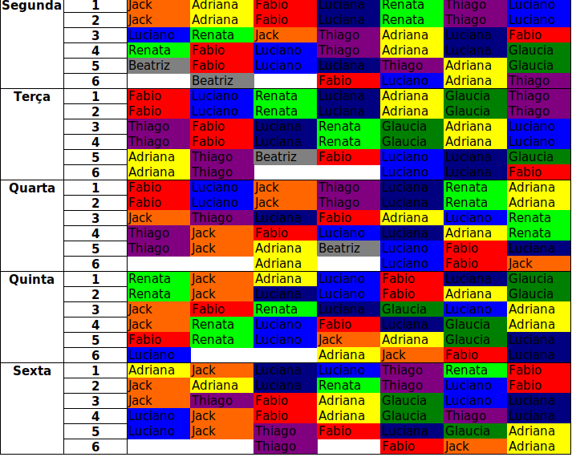

Simulated Annealing Algorithm for school timetables
==================

Scripts implementing a Simulated Annealing algorithm that generates 
school timetables, given each teacher's number of classes and schedule
restrictions.

Generation Approach
----------------------

`scheduler.cpp` implements a Simulated Annealing algorithm:

- A random schedule with the correct number of classes is generated
- The cost (quality) of the schedule is calculated, taking into account
  clashes between classes, class groupping, excess classes and user-defined
  restrictions 
- Teachers are swapped around randomly using the Simulated Annealing method, 
  where at the beggining all swaps are accepted, but as the algorithm progresses,
  only changes with a positive impact are performed
- This process minimizes the cost, thus maximizing the quality of the generated
  schedule

Functionality
----------------------

- `control.py` generates configuration csv files from configuration spreadsheets
- `scheduler.cpp` implements the algorithm, saving the timetables found in
  text files
- `converter.py` then converts the raw output data to a excel spreadsheet
  containing the generated schedule

Inputs and Outputs
----------------------

- Example of a schedule geneated by the algorithm:

- [Spreadsheet specifying the number of timeslots occupied by each teacher by class](https://github.com/allanwk/RRGA_scheduler/blob/master/images/n_aulas_por_professor.png)
- [Spreadsheet specifying the number of different subjects per teacher](https://github.com/allanwk/RRGA_scheduler/blob/master/images/materias_por_professor.png)
- [Example of complex restrictions (weigthed) for a teacher](https://github.com/allanwk/RRGA_scheduler/blob/master/images/restricoes.png)
- [Example of restrictions for a teacher](https://github.com/allanwk/RRGA_scheduler/blob/master/images/restricoes_simples.png)

Features
----------------------

- User-defined weighted scheduling restrictions for each teacher
- Special restriction type - teacher has to teach only the last class
- User can define exact timeslots for classes that have to be fixed in place